## Отчет по проделанной работе по заданию "6. Масштабирование приложений"

* Выполните задание “Docker registry for Linux Part 1” и продемонстрируйте на скриншоте содержимое registry, смонтированное на последнем шаге “Running a Registry Container with External Storage” после публикации там образа hello-world
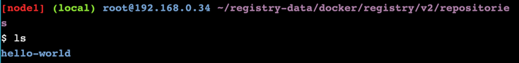

* Выполните задание “Authenticating with the Registry” и продемонстрируйте любым способом, что вы подключаетесь к registry по протоколу https и проходите аутентификацию (продемонстрировав успешный и не успешный её исход).
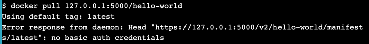

* Выполните все шаги и продемонстрируйте на скриншотах характеристику узлов в режиме Active и в режиме Drain. 
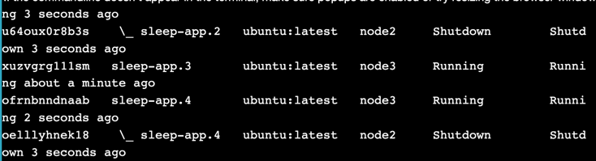
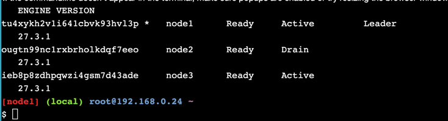
* Восстановите состояние узла (который был установлен в состояние Drain) снова в состояние Active. Ответьте на вопрос: восстановилась ли работа запущенного сервиса на этом узле? Ответьте на вопрос: что необходимо сделать, чтобы запустить работу службы на этом узле снова?  
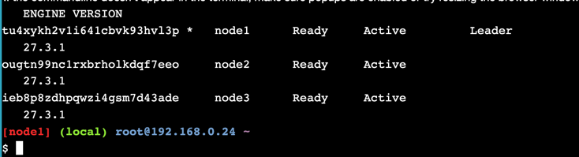
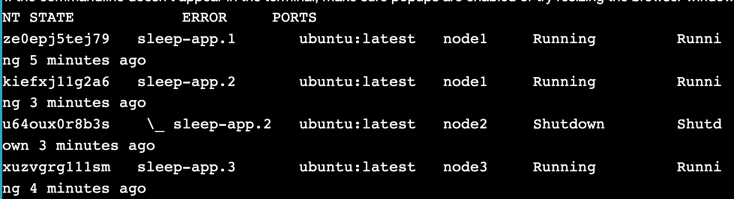
Работа сервиса не восстановилась, контейнеры в статусе Shutdown. Swarm балансирует только исходя из количества реплик, но не перемещает задачи обратно. Если пересоздать сервис, docker service update --force sleep-app, то статус снова станет active и работа перераспределится по активным нодам  
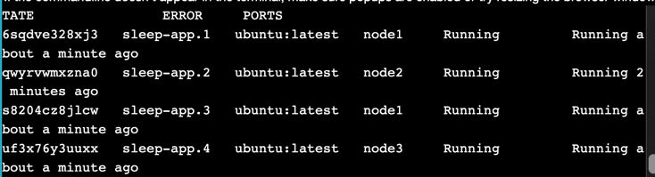
* Изучите материал «Swarm stack introduction» (https://training.play-with-docker.com/swarm-stack-intro/). Выполните эти действия. Зафиксируйте в отчете как конфигурируется количество нодов в стэке. Зафиксируйте в отчете как организуется проверка жизнеспособности сервисов, участвующих в docker-compose.yml.
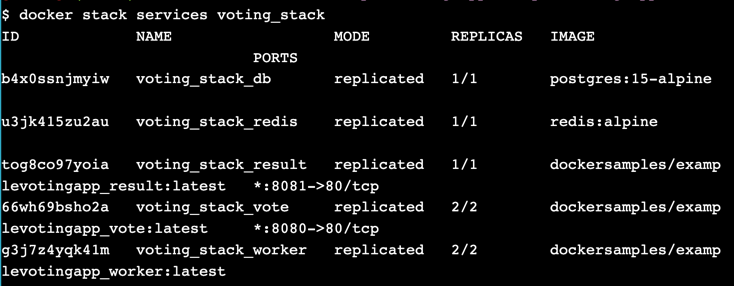
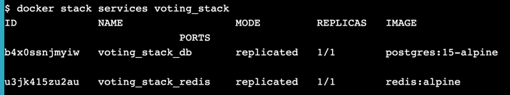
количество реплик конфигурируется в docker-compose.yml
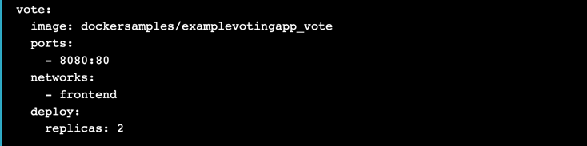
* На основе репозитория со счетчиком, реализуйте кластеризованный вариант развертывания приложения, чтобы количество инстансов с контейнером , где работает Flask было равно 4. Используя нагрузочное тестирование подтвердите или опровергните изменился ли потенциал при обработке запросов. 
Тестировать нагрузку будем с помощью hey. 
./hey_linux_amd64 -z 30s -c 10 http://localhost
Далее поднимем кластер с 4мя инстансами
```yaml
version: "3.8"

services:
  web:
    image: counter:latest       # локальный образ
    ports:
      - "80:8000"            
    deploy:
      replicas: 4               # 4 инстанса Flask
      resources:
        limits:
          cpus: "0.5"
          memory: "512M"
      restart_policy:
        condition: on-failure
    environment:
      - REDIS_HOST=redis
    networks:
      - app-net

  redis:
    image: redis:7              # одна реплика Redis
    volumes:
      - redis-data:/data
    networks:
      - app-net

volumes:
  redis-data:

networks:
  app-net:
```
На одной ноде результат ожидаемо хуже


На четырех нодах ожидаемо лучше

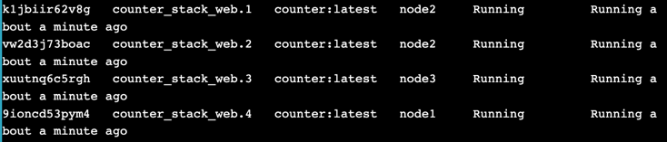

При увеличении нод redis лучше не стало  
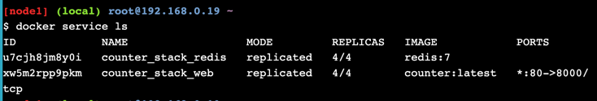  
  
Полагаю, потому что нужно настраивать репликацию еще в самом редисе, а так же давать нагрузку на него, а не просто запрашивать главную страницу

При использовании k3s получил похожий результат
```yaml
# -------------------------------
# ConfigMap для переменных окружения Flask
# -------------------------------
apiVersion: v1
kind: ConfigMap
metadata:
  name: web-config
data:
  # ключи из .env, пример
  DATABASE_URL: "redis://counter-redis-service:6379/0"
  FLASK_ENV: "development"
---
# -------------------------------
# Deployment для Flask
# -------------------------------
apiVersion: apps/v1
kind: Deployment
metadata:
  name: counter-web
spec:
  replicas: 4
  selector:
    matchLabels:
      app: counter-web
  template:
    metadata:
      labels:
        app: counter-web
    spec:
      containers:
        - name: web
          image: myapp_app:latest
          ports:
            - containerPort: 8000
          envFrom:
            - configMapRef:
                name: web-config
          readinessProbe:
            httpGet:
              path: /
              port: 8000
            initialDelaySeconds: 5
            periodSeconds: 10
          livenessProbe:
            httpGet:
              path: /
              port: 8000
            initialDelaySeconds: 15
            periodSeconds: 20
---
# -------------------------------
# Service для Flask
# -------------------------------
apiVersion: v1
kind: Service
metadata:
  name: counter-web-service
spec:
  selector:
    app: counter-web
  ports:
    - protocol: TCP
      port: 80
      targetPort: 8000
  type: LoadBalancer
---
# -------------------------------
# Deployment для Redis
# -------------------------------
apiVersion: apps/v1
kind: Deployment
metadata:
  name: counter-redis
spec:
  replicas: 1
  selector:
    matchLabels:
      app: counter-redis
  template:
    metadata:
      labels:
        app: counter-redis
    spec:
      containers:
        - name: redis
          image: redis:7-alpine
          command: ["redis-server", "--save", "60", "1", "--appendonly", "yes"]
          ports:
            - containerPort: 6379
          volumeMounts:
            - name: redis-data
              mountPath: /data
          readinessProbe:
            tcpSocket:
              port: 6379
            initialDelaySeconds: 5
            periodSeconds: 10
          livenessProbe:
            tcpSocket:
              port: 6379
            initialDelaySeconds: 15
            periodSeconds: 20
      volumes:
        - name: redis-data
          emptyDir: {}   # для тестов и dev, для продакшена заменить на PV
---
# -------------------------------
# Service для Redis
# -------------------------------
apiVersion: v1
kind: Service
metadata:
  name: counter-redis-service
spec:
  selector:
    app: counter-redis
  ports:
    - protocol: TCP
      port: 6379
  type: ClusterIP
```
Но напрямую их сравнивать нельзя, так как запущены они в разных окружениях
